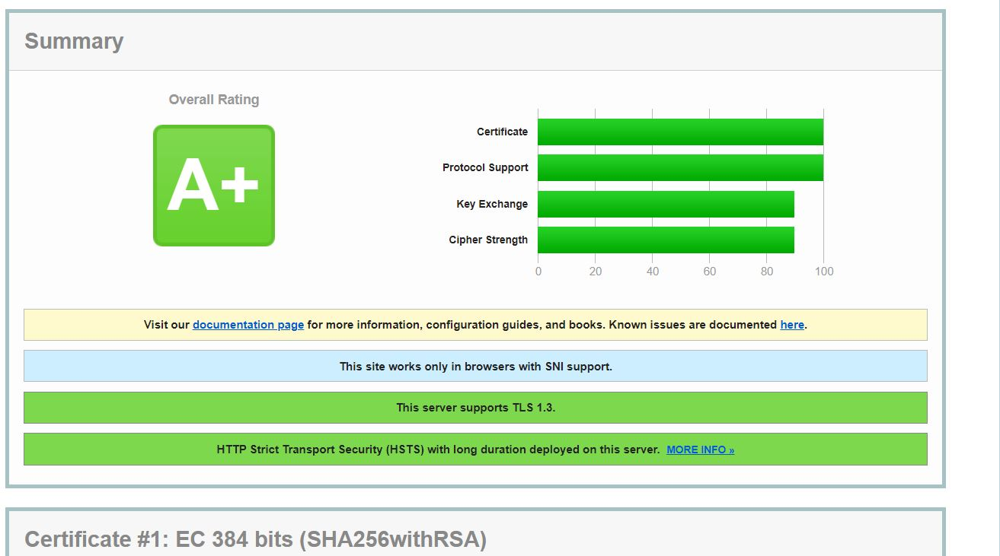
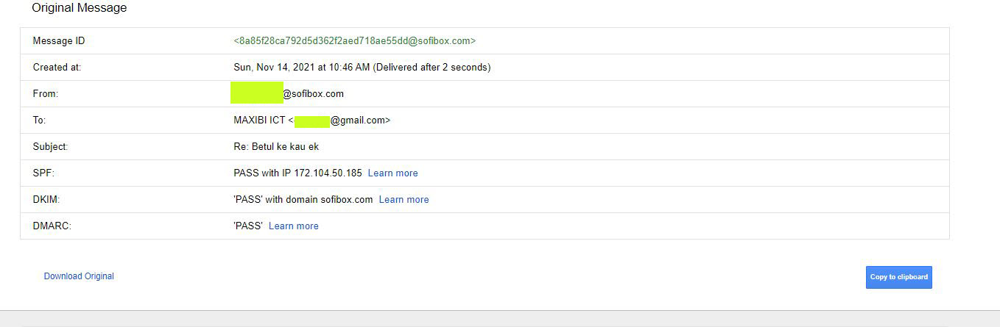
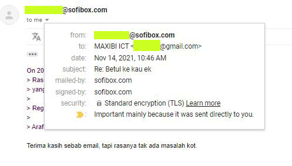
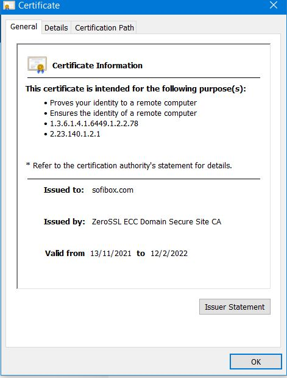

This is a personal project that I wrote for server automation to reduce server configuration time. 
The aim of this project is to have everything automated when deploying a new server without wasting a lot of time. 
For example setting up a secured server from scratch with hardened configs might take few days (I've experienced this) but this script will reduce that longer period to about 1 hour with one command! 
I focused a lot of security enhancements in this script for a new server deployment in order to reduce server malicious attack.

# Warning, you should not use this script if you don't know the purpose of this script. This script might contain bug (especially this public version)
There is another private version without ```_public``` name URL that always have the latest code and features.

# Maxinet - Automated Server Installation

This script is used to automatically harden new server with best practices

How to deploy?

1) Create a file called `execution_env` in the script path and edit the file and put the following text:

`local`

This will prevent the script from running remote related functions

2) To deploy a new server run the following command

`maxinet create-server --rebuild-all 2>&1 | tee maxinet.log `

Running example:

````
maxinet create-server --rebuild-all --backup
````

For example if everything is configured correctly for Directadmin and Linode in maxinet.conf, the above command will configure a new server disk and config in linode, it will then create custom ISO file for Debian, then it will install this operating system.
then do a lot of thing behind ... bla2 bla2 ... (read the code to understand what it does because it is huge to write what it does) ... and finally you will get a fully working server with live websites. So, with only a single command, you will get a clean server with security hardened features

The feature is currently huge to list out.

It might contain bugs for other distributions. This script is fully tested on Debian 10, Debian 11 and with Directadmin custom and auto installation. This script compatible with linode + directadmin

mail-tester.com score:


---

ssllabs.com score:



---

dkim, dmarc, and spf auto setup (including outbound signing policy for dkim):



---

mail is signed with secure certificate using the latest encryption:



---

auto SSL with zerossl or letsencrypt that can be backup and restore automatically



---

list of features (not all are listed right now):

1) Customize operating system (iso_api)
- Automatically create operating system ISO file (currently support Debian)
- Operating system version can be selected manually from config file (able to switch to old OS) or download latest version automatically (currently support Debian)
- Automatically upload ISO file (currently support dropbox) and generate random link to install operating system remotely
- Operating system ISO file can be backup automatically with option --backup before creating new one
- Able to use existing operating system without downloading the new one (offline mode)
- Operating system can be setup with LUKS encryption (can be turn off via config)
- Automatically generate installer bootloader menu for operating system with various settings.The boot menu screen can be customized (eg: Welcome to Arafat Operating System)
- Able to switch whether to create operating system ISO or rescue ISO (currently rescue ISO) --iso-base local/web
- Automatically write ISO script file for remote installer
- There are dozens of OS customization based on Debian preseed file.

2) Linode support (linode_api_admin)
- Automatically rebuild linode partition disk, swap
- Automatically rebuild linode profile config
- Various linode APIs included to manage initial setup
- and more ...

3) SSH management (ssh_api)
- Automatically login into server with shortcut (eg: maxinet login, to login as root using cert)
- Easy to retrieve and upload files
- Automatically unlock LUKS encryption remotely
- Easy to manage linode lish console
- Able to create secure private and public RSA key that compatible with putty for Windows
- and more ...

- Enable server SFTP, FTPS and disable unsecure FTP connection
and more ..

and more ..

to be continued ...

Author: Arafat Ali | Email: arafat@sofibox.com | Personal Blog: arafatx.com
